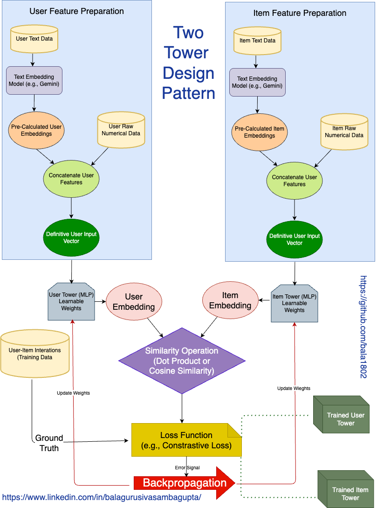

# Two Tower Design Pattern — Offline Joint Training

The offline joint training phase is where both towers actually learn. This is the foundation of the entire recommendation system — get this wrong and nothing downstream works.



## What's Happening Here?

The goal is simple: train two separate neural networks — one for users, one for items — so that when a user and a relevant item are compared, their vectors end up close to each other.

Both towers are trained together in one joint process. That's the "joint" part.

## Feature Preparation — Before Any Training Starts

Each tower needs clean, structured input before it can learn anything.

### User side:

You start with two types of data — raw text (like past search queries or reviews) and raw numerical data (like age, purchase count, price range). The text goes through a text embedding model like Gemini, which converts it into a dense vector. That vector and the numerical data are then concatenated into one single input vector. That's what the User Tower actually sees.

### Item side:

Same pattern. Item text data (product title, description) runs through Gemini. Item numerical data (price, ratings, category codes) is kept separate. Both are concatenated into one definitive item input vector.

This concatenation step matters. It ensures each tower gets a complete, unified picture — not a fragmented one.

## The Two Towers

Both towers are MLPs — Multi-Layer Perceptrons. Plain neural networks with learnable weights.

- The User Tower takes the user input vector and compresses it into a User Embedding
- The Item Tower takes the item input vector and compresses it into an Item Embedding

Both embeddings must be the same size. That's a hard constraint, because the next step compares them directly.

## Similarity Operation

Once you have both embeddings, you compute a similarity score between them — either a dot product or cosine similarity. This single number tells you: how relevant is this item for this user?

```High score = good match. Low score = poor match.```

## Loss Function + Backpropagation

This is where the learning actually happens.

You feed in real User-Item interactions as training data — clicks, purchases, views. That's your ground truth. The loss function (typically contrastive loss) compares the model's predicted similarity scores against that ground truth and measures how wrong the model is.

The error signal flows backwards through backpropagation and updates the weights in both towers simultaneously. The User Tower and Item Tower correct themselves together, in one pass.

This repeats across millions of training examples until both towers get good at their job.

## What Comes Out

At the end of training, you have two separate, standalone artifacts:

- A Trained User Tower — ready to generate user embeddings in real time
- A Trained Item Tower — ready to batch-process your entire product catalog

These are then deployed independently. The item tower runs offline once to generate all product embeddings. The user tower runs online, per request, to match users to those pre-computed embeddings.

That separation is exactly what makes this system fast at scale.

